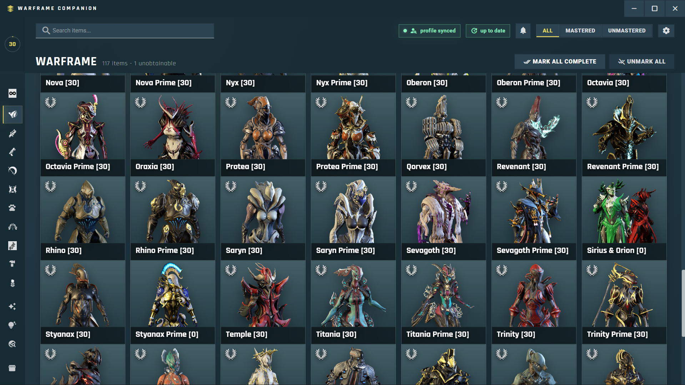

<table>
  <tr>
    <td width="96" valign="top">
      
    </td>
    <td valign="top">
      <h1>Warframe Companion App</h1>
      <p>
        A complete free and open source program to track your mastery and see what is tradable or not with many
        feature all in one app.
      </p>
    </td>
  </tr>
</table>

<p>
  <a href="https://github.com/Hasan580/Warframe-companion-app">Repository</a> |
  <a href="#features">Features</a> |
  <a href="#installation">Installation</a> |
  <a href="#build-and-release">Build and Release</a> |
  <a href="./CONTRIBUTING.md">Contributing</a>
</p>

## Overview

Warframe Companion App is an Electron desktop utility focused on quality-of-life workflows for Warframe players:

- Track mastered and unmastered items by category
- Search and filter large item collections quickly
- View item details, drops, and crafting requirements
- Access Warframe Market and trading tools from one place
- Monitor Prime Resurgence and worldstate information
- Use the MR Calculator and progress stats to plan mastery goals

## Features

- Category-driven item explorer
- Mastery progression ring and completion metrics
- Real-time filters for all, mastered, and unmastered items
- Item detail modal with acquisition and crafting context
- Market view with whisper copy actions
- Prime Resurgence and Worldstate panels
- Native Electron window controls and update checks

## Application Preview




## Tech Stack

- Electron
- Vanilla JavaScript (CommonJS)
- HTML
- CSS
- electron-builder

## Public APIs Used

This project uses public community and game-related APIs, including:

- [WarframeStat](https://github.com/WFCD)
- [warframe.market](https://warframe.market/api_docs)
- GitHub Releases API for app updates

## Installation

### Prerequisites

- Node.js 18+
- npm 9+

### Local development

```bash
npm install
npm run dev
```

## Build and Release

### Standard Windows build

```bash
npm run build
```

### Other useful commands

```bash
npm run package
```

## Project Structure

```text
assets/                     App icon and static assets
index.html                  Main UI markup
styles.css                  Application styling
renderer.js                 UI logic and data integration
market.js                   Market panel behavior
main.js                     Electron main process
preload.js                  Electron preload bridge
```

## Contributing

Contributions are welcome. Read [CONTRIBUTING.md](./CONTRIBUTING.md) before opening a pull request.

## Code of Conduct

Please follow the guidelines in [CODE_OF_CONDUCT.md](./CODE_OF_CONDUCT.md).

## Disclaimer

This is a community-built companion application and is not an official Digital Extremes product.
Warframe and related names are trademarks of Digital Extremes Ltd.

## License

This project is licensed under the [MIT License](./LICENSE).
